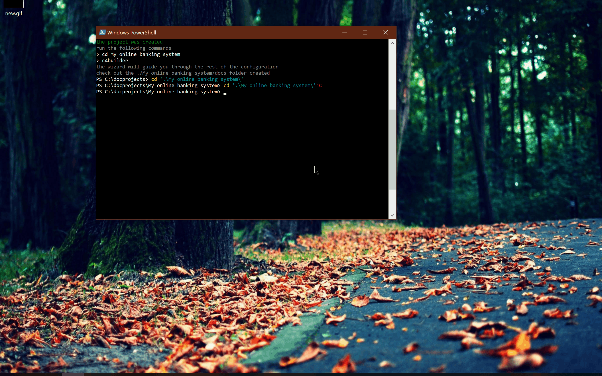
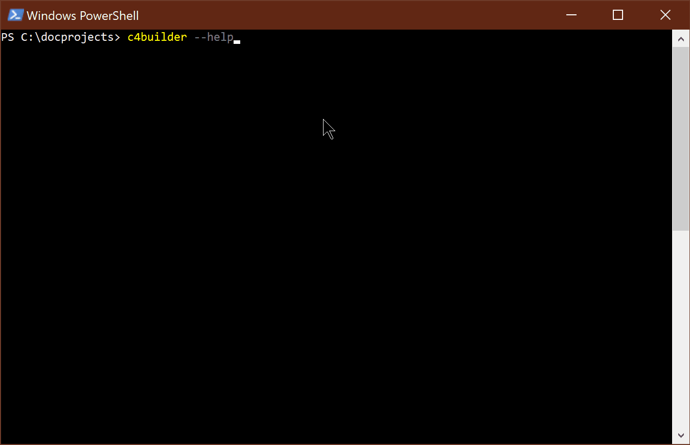
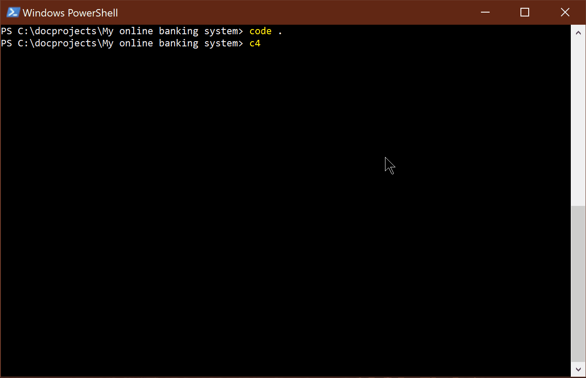
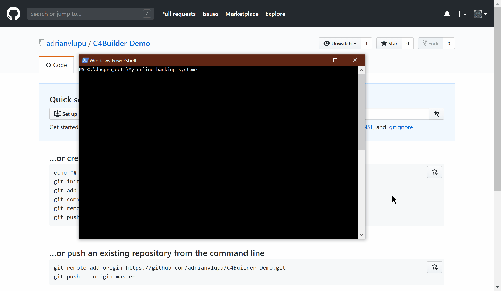
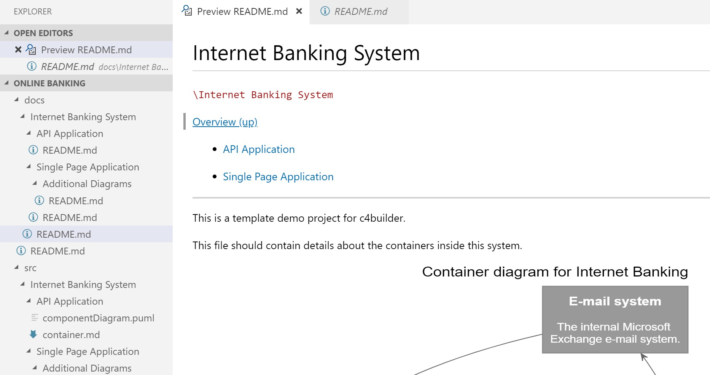
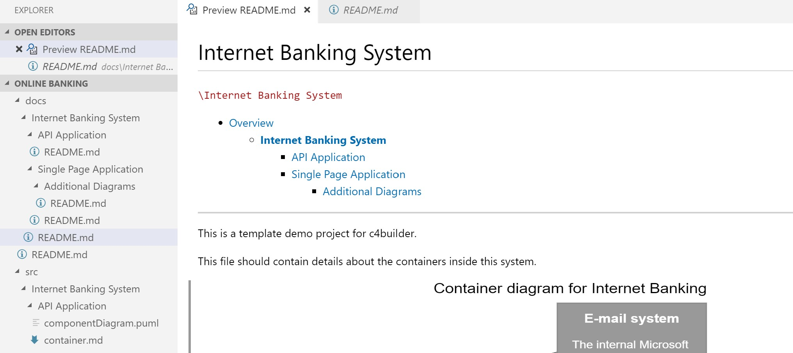
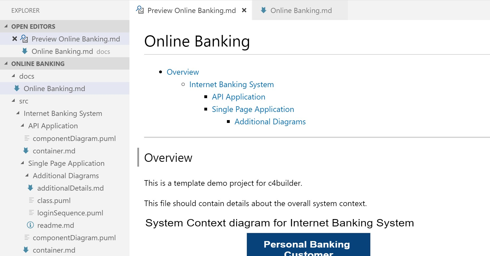
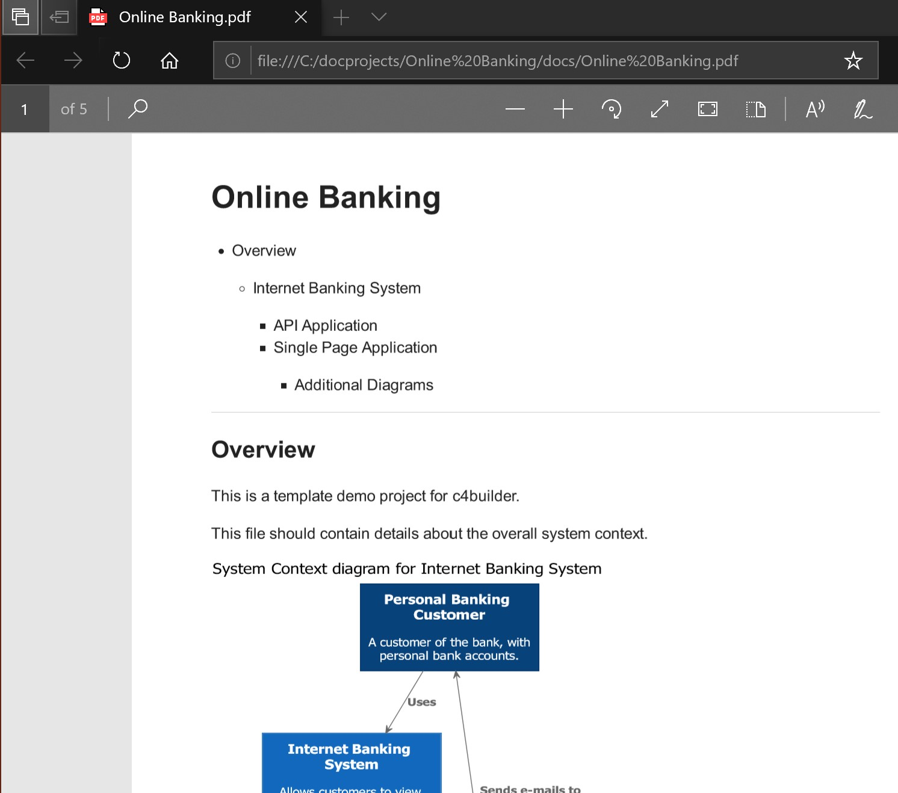
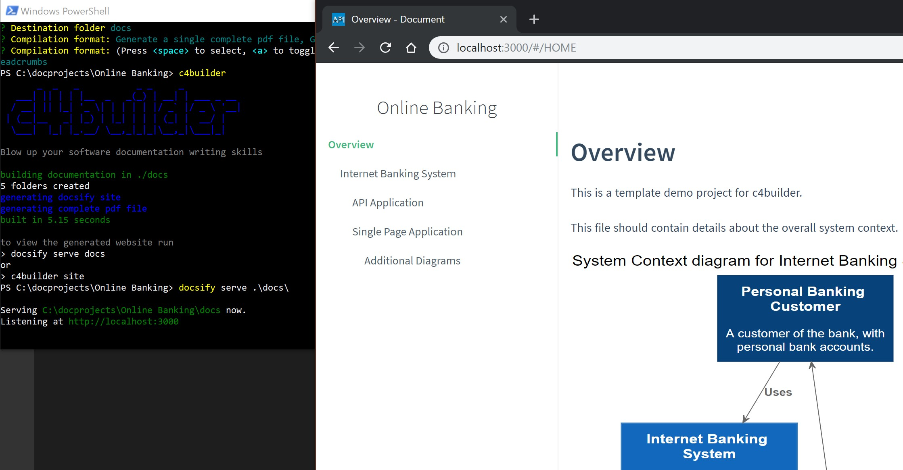

# Overview

c4builder is a lightweight nodejs cli tool for building, maintaining and sharing a software architecture project using only text.

The main idea behind the project is that a **developer** could use familiar tools to define software. 

Combined with **git** any change to the architecture defined in those documents is easily traced. Pull requests, branches, cherry picks and all of the git features could be used as an easier way to keep track of the projects architectural changes.

It relies on these great projects :

- [PlantUml](http://plantuml.com/) creates diagrams from plain text.

- [Markdown](https://guides.github.com/features/mastering-markdown/) creates rich text documents from plant text.

- [C4Model](https://c4model.com/) the idea behind maps of your code

- [C4-PlantUML](https://github.com/RicardoNiepel/C4-PlantUML) C4 syntax support for generating plantuml diagrams

- [Docsify](https://docsify.js.org/) creates a single page site based on markdown files.

- [vscode-plantuml](https://github.com/qjebbs/vscode-plantuml) plugin for visual studio code to view diagrams at design time

I strongly encourage people to check them out first but if you want to dive right in, the *new project* template should be easy to understand and edit.

<!--  -->



# Getting started

`npm i -g c4builder`

The easiest way to get started is with the *new project* template.



```bash
c4builder new
cd project
c4builder
```

## Available Commands

```bash
PS C:\docprojects\Online Banking> c4builder --help
Usage: index [options]

Options:
  -V, --version  output the version number
  new            create a new project from template
  config         change configuration for the current directory
  list           display the current configuration
  reset          clear all configuration
  site           serve the generated site
  docs           a brief explanation for the available configuration options
  -h, --help     output usage information
```

By default, running `c4builder` will attempt to build the project.

If no configuration was set it will ask for it and then do the actual build. Running just `c4builder` after a configuration will no longer show the wizard.

To change the configuration after building for the first time just run `c4builder config`. The default will be the configuration set previously so you can just edit the options you are interested in.


## The project

The project consists of two main folders. The **source** folder and the **destination** folder.

Following the C4 model, folders inside the **source** represent Systems/Containers/Components or any other additional type of information regarding the software.

```bash
│   .gitignore
│   README.MD
├───docs # destination folder
└───src # source folder
    │   context.md
    │   context.puml
    └───Internet Banking System
        │   system.puml
        │   system.md
        ├───API Application
        │       container.puml
        │       container.md
        └───Single Page Application
            │   container.puml
            │   container.md
            └───Additional Information
                    additionalDetails.md
                    class.puml
                    sequence.puml
                    class.1.md
```

The **destination** folder is automatically generated by the **build** process and can have various formats. The folder can provide a drill down style view of the Systems/Containers/Components in different ways. Either by pushing it as a site to gitpages, using it as a navigable markdown directly in the repository or by generating pdfs and using the traditional mail.

## The build

The **build** process consists of parsing the folder structure and merging together all the information found in the markdown files and diagrams into a single file per folder. 

The basic navigation, table of contents, local generation of images and their inclusion in the end documentation is automatically handled.

c4builder comes with a wizard for managing configuration for each project folder.



> NOTE
>
> Files starting with _ will be ignored during the build process

## The output

Using the configuration wizard you can choose any combination of outputs. By default all are enabled.

The output should have the same folder structure as the **source**. Each `.md` file inherits all the contents from the source `.md` files in that folder and appends either a link or the actual diagram images at the bottom/top of the file.

```bash
│   .gitignore
│   README.MD
├───docs
│   │   README.md
│   └───Internet Banking System
│       │   README.md
│       ├───API Application
│       │       README.md
│       └───Single Page Application
│           │   README.md
│           └───Additional Diagrams
│                   README.md
└───src
    │   ...
```

### Collection of markdowns with navigation

The generated markdown files can be pushed to git and viewed directly as a readme.



#### Options:

- basic navigation

  The basic navigation comes in the form of a menu providing a link to the parent and descendants.

  

- table of contents (default)

  The table navigation always shows all entities and bolds the current one
  
  

### Single markdown file

Outputs into a single file containing all entities. It includes a table of contents and a 'go to top' link after each section.

The generated markdown file makes for an easy single page readme for the repository.



### Collection of pdf files each describing one entity

A fast way to pass around information regarding only one particular System/Container/Component


    
### Single pdf file with a table of contents
   
The easiest format to share the full documentation



### Docsify site with a sidebar

After choosing to generate a docsify site, it can be viewed locally by running `c4builder site` and accessing `http://localhost:3000`;

The site is minimalistic including only a sidebar with the System/Container/Components hierarchy.

The sidebar is generated manually so that it only contains the main entities defined in the project in a hierarchical way.



By going to the github repository settings and enabling GitHub pages the site be pushed with ease and provide an overview to all people involved in the project without having to worry about which version of pdf file got sent when.


### Generate diagrams locally

By default this option is disabled. The output will contain image files generated using the plantuml server.

```md

```

If enabled, all images will be generated using the local copy of plantuml and will get added to the **destination** folder.

### Replace diagrams with link

By default this is disabled. If enabled, the output will no longer include the actual diagrams but a link to the image file.

### Include breadcrumbs

The current entity structure is inserted after the header

### Custom pdf

If defined, this css is used in the generation of the pdf files. It is useful for changing the font size `body{font-size:26px;}` on devices with high resolution screens.

# Limitations

- The current version does not support source and destination folders deeper than one level.

- Including a local image in a markdown will break after the build process.

# Future plans

I would like to bind the **build** phase to the C4 model. It could parse the diagrams and know what Person/System/Component/Container is related to what and help with additional validation. Maybe even export to [structurizr](https://structurizr.com/) or vice versa.

The project is still in it's early phase and I intend on using it on some actual projects in order to find more use cases and fix bugs.

# Change log

## v0.1.7

Changed template to include the latest C4-PlantUML`!include https://raw.githubusercontent.com/adrianvlupu/C4-PlantUML/latest/...`

## v0.1.6

Switched from http-server module to express for serving the static site.

Added the option to place diagrams before text.

## v0.1.5

PlantUML recently switched to V1.2019.6 adding some breaking changes to `!define` and `!definelong`. You can still use them but when calling you have to add `()` method call (http://plantuml.com/preprocessing)

Considering they updated their server to use the new version, diagrams generated locally that display correctly won't work on the plantuml server and viceversa

Until the underlying `node-plantuml` package gets updated, I changed the dependency to the fork at https://github.com/adrianvlupu/node-plantuml.git

Also the `!include` directives on each template diagram point to the 1.2019.6 compatible version hosted at https://github.com/adrianvlupu/C4-PlantUML.